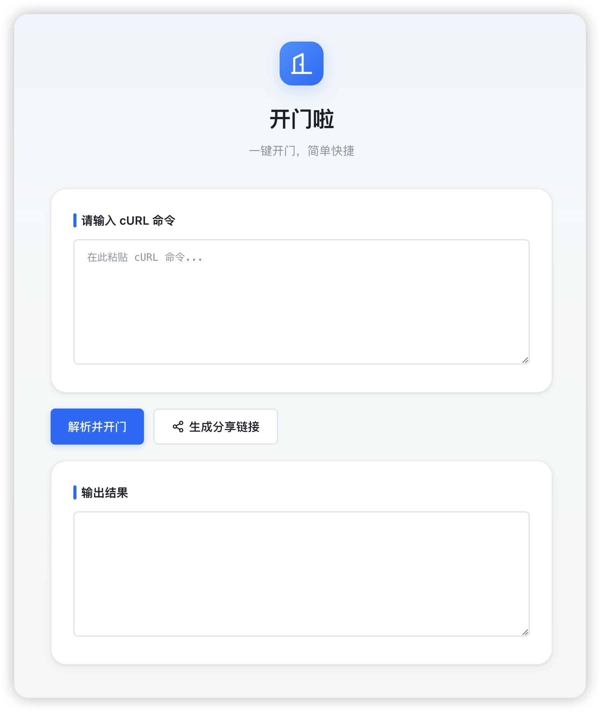
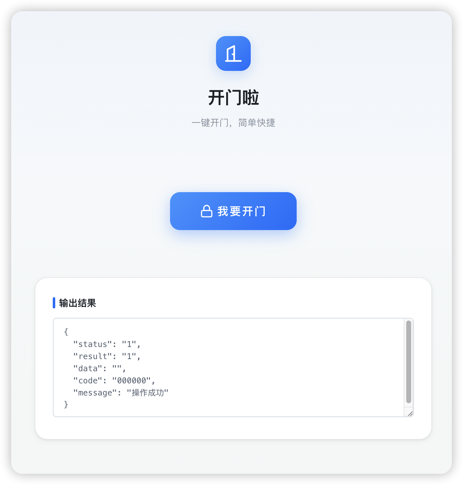

# 开门啦

> 一键快速开门，无需再打开微信小程序。

## 背景

深圳平安视频门禁需要通过微信小程序进入、加载、点击后才能开门，日常使用起来比较繁琐。本项目通过解析门禁的 cURL 请求，把开门能力做成一个轻量 Web 页面，添加到手机桌面后一键直达。

## 功能特性

- **一键开门**：粘贴 cURL 命令后，点击按钮即可发送开门请求
- **分享链接**：生成带参数的链接，家人打开后点击「我要开门」即可使用
- **结果推送**：开门结果通过 Bark 推送到手机
- **命令记忆**：自动保存上一次使用的 cURL 命令
- **PWA 友好**：可添加到手机主屏幕，像原生 App 一样使用

## 页面预览

**主界面**



**分享开门**



## 项目结构

```
unlock-door/
├── index.html          # 入口页面
├── favicon.svg         # 项目图标
├── css/
│   └── style.css       # 样式表
├── js/
│   ├── curl-parser.js  # cURL 解析器
│   ├── api.js          # HTTP 请求与 Bark 推送
│   ├── share.js        # 分享链接生成
│   └── app.js          # 页面交互逻辑
├── config.js           # 本地配置文件
├── .gitignore
└── README.md
```


## 技术栈

- HTML5 + CSS3 + 原生 JavaScript（ES5+）
- CSS Variables + BEM
- Fetch API + AbortController
- localStorage

## 声明

**切勿用于非法用途**。本工具仅供合法授权的个人门禁使用，请妥善保管分享链接。

## License

MIT
